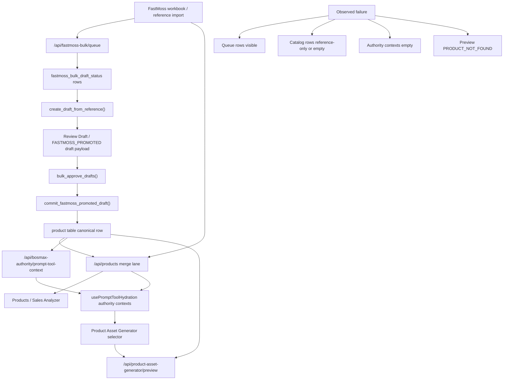

# BOSMAX Product Pipeline Wiring Scout Audit V1

## 1. Executive Verdict

**Verdict: HOLD.**

The current BOSMAX product pipeline does **not** operate as one auditable product truth flow. The repo currently exposes at least three materially different read models:

1. **FastMoss queue / Smart Registration lane**
   `dashboard/src/components/product-registration/BulkFastMossConvertTab.tsx:122-156` reads `/api/fastmoss-bulk/queue/stats` and `/api/fastmoss-bulk/queue`, while approval posts to `/api/fastmoss-bulk/queue/bulk-approve-drafts` (`BulkFastMossConvertTab.tsx:311-345`).
2. **Products / Sales Analyzer catalog lane**
   `dashboard/src/pages/ProductsSalesAnalyzerPage.tsx:699-722` reads `/api/products`, which is assembled from persisted DB products plus merged FastMoss reference rows in `agent/api/products.py:454-622`.
3. **Product Asset Generator authority lane**
   `dashboard/src/components/prompt-tool/usePromptToolHydration.ts:118-180` hydrates from `/api/bosmax-authority/prompt-tool-context` plus `/api/products`, but `productById` is built only from authority contexts; `agent/services/product_asset_generator_service.py:126-138` resolves preview products only through `crud.get_product`.

That split creates the observed failure pattern:

- Smart Registration can show queue rows and approval states.
- Products / Sales Analyzer can show only reference products or zero committed/manual products depending on runtime DB state.
- Product Asset Generator can display selectable products from catalog fallback while still failing authority hydration and preview resolution.

This is not a UI-only bug. It is a **cross-surface read-model split with ID-join failure**. The runtime API and repo-local DB evidence also conflict, but the backend DB binding is **NOT PROVEN / ENVIRONMENT-CONTAMINATED**, so no confirmed storage-drift conclusion is claimed in this audit.

## 2. Current Data Flow Diagram



### Actual state machine found in code

| State / artifact | Where created | Owning code | Storage / table | Primary ID |
|---|---|---|---|---|
| `FASTMOSS_REFERENCE` | FastMoss reference catalog | `agent/api/products.py:569-593` | reference feed merged at read time, not canonical `product` row | `reference_id` / `fastmoss-ref:*` |
| Queue row | Queue sync + queue API | `agent/api/fastmoss_bulk.py:54-179` | `fastmoss_bulk_draft_status` via CRUD | `reference_id` |
| `PENDING_DRAFT` / `DRAFT_GENERATED` style draft progression | Draft creation service path | `agent/services/fastmoss_bulk_promotion_service.py:451-559` | queue row + registration draft payload | `draft_id` plus `reference_id` |
| `READY_FOR_APPROVAL` | Promotion classifier | `agent/services/fastmoss_bulk_promotion_service.py:67-87` | queue row | `reference_id` |
| `CLAIM_RISK` / `MISSING_REQUIRED_FIELD` / `DUPLICATE_LINKED` | Promotion classifier | `agent/services/fastmoss_bulk_promotion_service.py:67-87` | queue row | `reference_id` |
| `APPROVED` queue status | Bulk approve | `agent/services/fastmoss_bulk_promotion_service.py:588-666` | queue row | `reference_id` |
| Canonical committed product row | Registration commit | `agent/services/registration_commit_service.py:103-140` | `product` table | `product_id` / UUID |

### Surface / API ownership matrix

| Surface | Endpoint | Backend owner | Storage authority | ID used by surface | Output shape / key fact |
|---|---|---|---|---|---|
| Smart Registration bulk tab | `/api/fastmoss-bulk/queue`, `/queue/stats` | `agent/api/fastmoss_bulk.py:54-179` | `fastmoss_bulk_draft_status` and draft payloads | `reference_id`, `draft_id`, `committed_product_id` | Queue-first operational state |
| Products / Sales Analyzer | `/api/products` | `agent/api/products.py:454-645` | persisted `product` rows plus merged FastMoss reference rows | `product_id` or `reference_id`-derived catalog identity | Catalog view can include `reference_only` rows |
| Prompt Tool / Asset Generator hydration | `/api/bosmax-authority/prompt-tool-context` | `agent/services/bosmax_authority_registry.py:287-416,692-720` | persisted `product` rows only | `product_id` from authority contexts | No merged reference catalog support |
| Product Asset Generator preview | `/api/product-asset-generator/preview` | `agent/api/product_asset_generator.py:12-19` + `agent/services/product_asset_generator_service.py:1048-1200` | `crud.get_product` canonical DB lookup only | `product_id` only | Hard fail-closed preview only |

## 3. Broken Joins / Mismatched IDs

### Join failure 1: selector options can exist without authority context

`usePromptToolHydration` loads authority context and catalog in parallel (`dashboard/src/components/prompt-tool/usePromptToolHydration.ts:118-121`). It then builds `productById` only from `authorityContexts` (`usePromptToolHydration.ts:162-170`). `productOptions` prefer authority options but can fall back to `state.products` (`usePromptToolHydration.ts:172-180`).

`ProductAssetGeneratorForm` resolves the selected product through `hydration.productById[draft.product_id]` (`dashboard/src/components/product-asset-generator/ProductAssetGeneratorForm.tsx:1302-1304`). The downstream hydration patch only fires when that `selectedProduct` exists (`ProductAssetGeneratorForm.tsx:1316-1335`).

**Result:** the selector can list catalog products that never resolve into authority-backed `selectedProduct`.

### Join failure 2: preview backend only trusts persisted `product` rows

`agent/services/product_asset_generator_service.py:126-138` resolves the seed product through `crud.get_product(request.product_id)` only. If absent, preview returns `PRODUCT_NOT_FOUND`. The preview entrypoint remains hard preview-only and fail-closed in `product_asset_generator_service.py:1048-1200`.

**Runtime proof**

- `POST /api/product-asset-generator/preview` with `product_id=fastmoss-ref:613e6aeb961c103b` returned `preview_status=FAIL` and `errors=["PRODUCT_NOT_FOUND"]`.
- `GET /api/bosmax-authority/product-context/fastmoss-ref:613e6aeb961c103b` returned `product_context=null` and warning `PRODUCT_CONTEXT_NOT_FOUND`.

The reference row is visible in `/api/products`, but it is not resolvable in authority or preview lanes.

### Join failure 3: BOSMAX authority registry does not read the merged catalog lane

`agent/services/bosmax_authority_registry.py:287-416` builds product contexts from `crud.list_products(limit=5000)` only. It does not consume `/api/products` merged catalog logic and does not pull `list_fastmoss_reference_products`.

`agent/api/products.py:569-593` separately appends FastMoss reference products into `/api/products`.

**Result:** `/api/products` and `/api/bosmax-authority/prompt-tool-context` can disagree even inside the same process.

### Join failure 4: queue approval does not guarantee downstream visibility without runtime DB alignment

`bulk_approve_drafts` writes `committed_product_id` back to queue rows (`agent/services/fastmoss_bulk_promotion_service.py:588-666`). The detail panel surfaces that linkage in `BulkFastMossConvertTab.tsx:1508-1516`.

But the live runtime returned:

- queue stats: `total=5`
- `/api/products?source=MANUAL`: `total_count=0`
- authority product contexts: `0`

while the repo-local DB snapshot at `agent.config.DB_PATH` showed:

- `product_total=508`
- `product_manual_total=210`
- `product_fastmoss_promoted_manual_rows=204`
- `bulk_queue_total=298`
- `bulk_queue_approved=203`

**Result:** commit linkage exists in the data model, but trustworthy cross-surface visibility remains **NOT PROVEN / ENVIRONMENT-CONTAMINATED** in the live runtime because the backend DB binding could not be closed.

## 4. Field Standardization Matrix

### Source fields vs internal truth fields

| Semantic role | Source / external fields | Internal fields found | Produced by | Consumed by |
|---|---|---|---|---|
| Source taxonomy | `category`, `subcategory`, `type` | `group`, `sub_group`, `type_of_product` | `agent/services/product_truth_service.py:157-177,400-420`; mapping/family services; product asset context builder `agent/services/product_asset_generator_service.py:289-330` | Products Analyzer, Product Asset Generator, authority panels |
| Family truth | n/a from raw source | `bosmax_product_family` | `product_truth_service.py:406-420` and mapping services | Products Analyzer, asset preview |
| Product typing | `type`, product mapping result | `product_type`, `product_type_id` | persisted product row and mapping logic | Products Analyzer, registration flows |
| Source provenance | `source`, source workbook lane | `source_lane`, `mapping_source`, `fastmoss_reference_id`, `reference_only` | bulk promotion + product API merge | Queue, catalog, commit path |
| Copy safety | raw title/description claims | `copy_route`, `claim_gate`, `claim_risk_level` | mapping + claim gate services | queue approval, asset preview, analyzer |
| Readiness | image signals / prompt signals | `image_readiness_status`, `prompt_readiness_status` | queue classifier, product enrichment, preview | queue UI, analyzer, asset preview |
| Confidence | raw/category reconciliation | `intelligence_confidence` and PTR reconciliation confidence | mapping / PTR / intelligence services | analyzer, audit surfaces |

### Standardization findings

1. The repo has **two simultaneous taxonomy narratives**.
   `product_truth_service.py:157-177` preserves source anchors from FastMoss raw taxonomy, while `product_truth_service.py:400-420` emits final BOSMAX family/group/subgroup outputs from mapping and family profiles.
2. Products / Sales Analyzer displays both raw-style and normalized fields together.
   `dashboard/src/pages/ProductsSalesAnalyzerPage.tsx:1632-1907` renders `category`, `subcategory`, `type`, `group`, `bosmax_product_family`, `copy_route`, `claim_gate`, and `intelligence_confidence`.
3. Promotion readiness does **not** require taxonomy confidence.
   `_classify_promotion_status` in `agent/services/fastmoss_bulk_promotion_service.py:67-87` checks duplicate status, claim risk, image readiness, and missing fields. It does not block low-confidence or obviously wrong family/category mappings.

### Fields that must never be silently renamed or dropped

- `reference_id`
- `draft_id`
- `product_id`
- `committed_product_id`
- `fastmoss_reference_id`
- `source`
- `source_lane`
- `mapping_source`
- `category`
- `subcategory`
- `type`
- `group`
- `sub_group`
- `type_of_product`
- `bosmax_product_family`
- `product_type`
- `product_type_id`
- `copy_route`
- `claim_gate`
- `claim_risk_level`
- `intelligence_confidence`
- `prompt_readiness_status`
- `image_readiness_status`
- `reference_only`

## 5. Runtime Evidence

### Runtime API samples

| Command | Key result |
|---|---|
| `GET /health` | `status=ok`, `dashboard_serving_mode=BACKEND_SERVED_STATIC`, `extension_connected=true`, `flow_key_present=false` |
| `GET /api/fastmoss-bulk/queue/stats` | `total=5`, `READY_FOR_APPROVAL=3`, `CLAIM_RISK=1`, `MISSING_REQUIRED_FIELD=1` |
| `GET /api/products?source=FASTMOSS&limit=500` | `total_count=300`; rows carried `source_lane=FASTMOSS_REFERENCE`, `reference_only=true` |
| `GET /api/products?source_lane=FASTMOSS_REFERENCE&limit=500` | same 300 reference rows |
| `GET /api/products?source=MANUAL&limit=20` | `total_count=0` |
| `GET /api/bosmax-authority/prompt-tool-context` | `product.options=[]`, `product.contexts=[]`, `sales_analyzer_wired_to_prompt_tools=false` |
| `GET /api/bosmax-authority/source-matrix` | `product_lane.source_status=NOT_FOUND` and warning `SALES_ANALYZER_NOT_WIRED_TO_PROMPT_TOOLS` |
| `POST /api/product-asset-generator/preview` with FastMoss ref id | `preview_status=FAIL`, `PRODUCT_NOT_FOUND` |
| `GET /api/bosmax-authority/product-context/{id}` with ref id and with sample UUID | `PRODUCT_CONTEXT_NOT_FOUND` in both cases |

### Runtime DB contradiction

Local DB inspection against `flow_agent.db` showed materially different state from the live API process:

| Metric | Live API | Local DB snapshot |
|---|---|---|
| Queue total | `5` | `298` |
| Approved queue rows | not exposed in sample list, stats subset only | `203` |
| Manual products | `0` | `210` |
| FastMoss-promoted manual rows | `0` implied by API | `204` |
| Authority product contexts | `0` | not directly materialized, but persisted products exist |

This contradiction is the highest-confidence evidence that the running backend is not reading the same effective storage snapshot that repo-local inspection used.

### Product Asset Generator preview-only labeling audit

The Product Asset Generator is mostly labeled correctly as non-execution preview:

- page header says `Preview-only · No image generation · No Flow execution` in `dashboard/src/pages/ProductAssetGeneratorPage.tsx:121-131`
- initial draft hard-locks `dry_run_only: true` in `ProductAssetGeneratorPage.tsx:28-45`
- page submit path calls `runProductAssetGeneratorPreview` only (`ProductAssetGeneratorPage.tsx:93-109`)
- form change handler forces `dry_run_only: true` on every patch (`ProductAssetGeneratorPage.tsx:144-162`)
- backend exposes only `POST /api/product-asset-generator/preview` (`agent/api/product_asset_generator.py:12-19`)

However, wording drift exists:

- UI contract test expects `Selecting a product uses product_id preview authority.` in `tests/ui/test_product_asset_generator_ui_contract.py:31-46`
- current form copy uses `Selecting a product uses product_id authority — scale truth, product physics, and label-safe framing all come from the product row.` in `dashboard/src/components/product-asset-generator/ProductAssetGeneratorForm.tsx:1552`

This is not proof of false execution claims, but it is proof that the wording contract and implementation have already drifted.

### Test evidence

Command executed:

```text
python -m pytest tests/api/test_fastmoss_bulk_api.py tests/api/test_product_asset_generator_api.py tests/unit/test_fastmoss_bulk_promotion_service.py tests/unit/test_product_registration_commit_service.py tests/ui/test_product_registration_ui_contract.py tests/ui/test_products_sales_analyzer_ui_contract.py tests/ui/test_product_asset_generator_ui_contract.py tests/ui/test_prompt_tool_authority_hydration_contract.py -q
```

Result:

- `145 passed`
- `1 failed`

Failing tests:

1. `tests/ui/test_product_asset_generator_ui_contract.py::test_product_asset_generator_ui_calls_only_the_preview_endpoint`
   This failure was observed in an earlier pre-governance run but did **not** reproduce in the mandatory rerun for this counter-audit.
2. `tests/ui/test_product_asset_generator_ui_contract.py::test_product_asset_generator_form_locks_dry_run_only_true_and_shows_truth_copy`
   The test expects `Selecting a product uses product_id preview authority.` but the current helper text no longer matches. This is the **only** failure reproduced in the mandatory rerun.

### Hidden regressions discovered

1. **Contract drift in Product Asset Generator UI tests.**
   The tests still assert literal strings that no longer match the implementation.
2. **Authority adapter explicitly declares Sales Analyzer not wired.**
   `agent/services/bosmax_authority_registry.py:606-720` emits `SALES_ANALYZER_NOT_WIRED_TO_PROMPT_TOOLS` and `sales_analyzer_wired_to_prompt_tools=false`.
3. **Promotion approval readiness ignores taxonomy confidence.**
   Wrong-family drafts can still reach `READY_FOR_APPROVAL`.
4. **Copy-route leakage across categories.**
   Live draft samples showed non-beauty products receiving beauty-style hooks and family assumptions, indicating mapping/prompt leakage beyond simple queue state.

### Data-loss / truth-loss risks

1. Rewiring any single surface without unifying the read model can orphan `reference_id -> draft_id -> committed_product_id -> product_id` lineage.
2. Silent field normalization between `category/subcategory/type` and `group/sub_group/type_of_product` can destroy source auditability.
3. If preview starts accepting non-canonical reference IDs without explicit provenance, downstream prompt/asset flows could treat review-only rows as committed truth.
4. Any live repair done against the wrong runtime snapshot can create false proof and accidental overwrite risk; because runtime DB binding is not proven, this risk remains **NOT PROVEN / ENVIRONMENT-CONTAMINATED** rather than confirmed storage drift.

## 5A. Failed Tests — Full Forensic Trace

### Mandatory rerun result

Authoritative rerun command:

```text
python -m pytest tests/api/test_fastmoss_bulk_api.py tests/api/test_product_asset_generator_api.py tests/unit/test_fastmoss_bulk_promotion_service.py tests/unit/test_product_registration_commit_service.py tests/ui/test_product_registration_ui_contract.py tests/ui/test_products_sales_analyzer_ui_contract.py tests/ui/test_product_asset_generator_ui_contract.py tests/ui/test_prompt_tool_authority_hydration_contract.py -q
```

Authoritative rerun outcome:

- `145 passed`
- `1 failed`

### Failure 1

- Exact test file: `tests/ui/test_product_asset_generator_ui_contract.py`
- Exact test function: `test_product_asset_generator_form_locks_dry_run_only_true_and_shows_truth_copy`
- Expected behavior: the Product Asset Generator form must still expose the exact wording contract `Selecting a product uses product_id preview authority.` to make the preview-only authority boundary explicit.
- Actual behavior: the form now renders `Selecting a product uses product_id authority — scale truth, product physics, and label-safe framing all come from the product row.` instead.
- Pre-existing or caused by audit changes: **pre-existing**. This audit touched only `docs/MODULE_STATUS.yaml` and this report file; no production UI code changed in this pass.
- Relevance to product pipeline wiring issue: **relevant**. The failing string sits exactly on the Product Asset Generator authority boundary, which is part of the wiring defect under audit.

Full failure message from the mandatory rerun:

```text
_ test_product_asset_generator_form_locks_dry_run_only_true_and_shows_truth_copy _

    def test_product_asset_generator_form_locks_dry_run_only_true_and_shows_truth_copy():
        form_source = _read(
            "dashboard/src/components/product-asset-generator/ProductAssetGeneratorForm.tsx"
        )
        page_source = _read("dashboard/src/pages/ProductAssetGeneratorPage.tsx")
        presets_source = _read(
            "dashboard/src/components/product-asset-generator/presets.ts"
        )

        assert "dry_run_only: true" in form_source
        assert "dry_run_only=true" in form_source
        assert "Derived suggestions are not canonical truth." in form_source
        assert "No repo-backed wardrobe registry exists in this checkout. Manual fallback remains required." in form_source
        assert "Operator-pack headwear suggestions are not canonical registry truth." in form_source
>       assert "Selecting a product uses product_id preview authority." in form_source
E       assert 'Selecting a product uses product_id preview authority.' in 'import { useEffect, useMemo, useRef, useState } from "react";\\nimport { useNavigate } from "react-router-dom";\\nimpor...10 px-3 py-2 text-[11px] text-red-200">\\n\\t\\t\\t\\t\\t{error}\\n\\t\\t\\t\\t</div>\\n\\t\\t\\t) : null}\\n\\t\\t</section>\\n\\t);\\n}\\n'

tests\\ui\\test_product_asset_generator_ui_contract.py:45: AssertionError
```

### Historical note

An earlier local run before the governance patch recorded a second failure for a literal `"/api/products?limit="` expectation in `dashboard/src/api/products.ts`. That failure did **not** reproduce in the mandatory rerun above, so it is not treated as current authoritative failure evidence.

## 5AB. Base-vs-PR Test Delta

### Command

```text
python -m pytest tests/api/test_fastmoss_bulk_api.py tests/api/test_product_asset_generator_api.py tests/unit/test_fastmoss_bulk_promotion_service.py tests/unit/test_product_registration_commit_service.py tests/ui/test_product_registration_ui_contract.py tests/ui/test_products_sales_analyzer_ui_contract.py tests/ui/test_product_asset_generator_ui_contract.py tests/ui/test_prompt_tool_authority_hydration_contract.py -q
```

### Base result

- Base SHA: `76e752711fbe40e6042a19a8bd32374d6047c786`
- Result: `145 passed, 1 failed in 15.39s`
- Exact failing test:
  - `tests/ui/test_product_asset_generator_ui_contract.py::test_product_asset_generator_form_locks_dry_run_only_true_and_shows_truth_copy`

### PR result

- PR head SHA: `fee0ed3a3ebfdb85504441361a8c7794f0575905`
- Result: `145 passed, 1 failed in 27.61s`
- Exact failing test:
  - `tests/ui/test_product_asset_generator_ui_contract.py::test_product_asset_generator_form_locks_dry_run_only_true_and_shows_truth_copy`

### Delta verdict

- Did the PR introduce the failing test: **No**
- Whether it blocks audit merge: **No**
- Recommended disposition: treat it as pre-existing UI contract drift and keep it out of this audit-only PR scope.

Reasoning:

The same command, the same test file, and the same assertion target failed on both base `main` and the PR head. This proves the audit PR did not introduce the failure.

## 5B. Runtime DB Binding Proof

### Process / config evidence

- Listener port: `127.0.0.1:8100`
- Listener PID: `11536`
- Listener process command:

```text
"C:\Users\USER\AppData\Roaming\uv\python\cpython-3.11-windows-x86_64-none\python.exe" -m agent.main
```

- Parent PID: `35752`
- Parent process command:

```text
"C:\Users\USER\AppData\Local\hermes\hermes-agent\venv\Scripts\python.exe" -m agent.main
```

- Config source: `agent/config.py:93-96`

```python
if _running_under_pytest():
    DB_PATH = Path(tempfile.gettempdir()) / f"flowkit-pytest-{os.getpid()}.db"
else:
    DB_PATH = BASE_DIR / "flow_agent.db"
```

### Inferred resolved DB path from local config

Direct local resolution from `agent.config.DB_PATH` in this checkout:

```text
C:\Users\USER\Desktop\_ref_flowkit\flow_agent.db
```

### Timestamped API response sample

`2026-07-04T08:21:07.210464Z`

```json
{
  "url": "http://127.0.0.1:8100/api/products?source=MANUAL&limit=20",
  "status": 200,
  "payload_excerpt": {
    "total_count": 0,
    "returned_count": 0,
    "has_pagination": false,
    "limit": 20,
    "offset": 0,
    "items": []
  }
}
```

`2026-07-04T08:20:40.401616Z`

```json
{
  "url": "http://127.0.0.1:8100/api/fastmoss-bulk/queue/stats",
  "status": 200,
  "payload": {
    "total": 5,
    "by_status": {
      "CLAIM_RISK": 1,
      "MISSING_REQUIRED_FIELD": 1,
      "READY_FOR_APPROVAL": 3
    },
    "by_risk": {
      "HIGH": 1,
      "LOW": 4
    }
  }
}
```

### Direct DB query sample from inferred path

`2026-07-04T08:21:07.242466Z`

```json
{
  "resolved_db_path": "C:\\Users\\USER\\Desktop\\_ref_flowkit\\flow_agent.db",
  "queue_total": 298,
  "manual_total": 210,
  "fastmoss_total": 298,
  "sample_queue": [
    {
      "reference_id": "fastmoss-ref:0b02b68a54121c4d",
      "promotion_status": "MISSING_REQUIRED_FIELD",
      "committed_product_id": null,
      "draft_id": "draft-06be1a6f",
      "updated_at": "2026-05-24T16:28:24Z"
    }
  ],
  "sample_products": [
    {
      "id": "ec2c8e7d-bdd4-4df3-88c4-9330fed2a3f7",
      "product_display_name": "(W)UGREEN PD20W Fast Charger Pengecas Pantas, Palam UK, dengan Set Kabel, Serasi dengan iPhone 8-16 Pro Max Samsung S25 Ultra Android Cellphone Mobile Phone Siri, SKU: 70297",
      "source": "MANUAL",
      "mapping_source": "FASTMOSS_PROMOTED",
      "fastmoss_reference_id": "fastmoss-ref:bb433cc5b5597bff",
      "updated_at": "2026-07-04T04:53:14Z"
    }
  ]
}
```

### Binding verdict

**Runtime DB binding is NOT PROVEN.**

Reason:

1. The live process command line confirms `python -m agent.main`, but does **not** expose a DB override or a working directory.
2. Local config resolution points to `C:\Users\USER\Desktop\_ref_flowkit\flow_agent.db`.
3. Direct SQL against that inferred DB path shows `queue_total=298` and `manual_total=210`.
4. Live API responses from the running `127.0.0.1:8100` backend show `queue total=5` and `manual total=0`.
5. No relevant `DB`, `FLOW`, `SQLITE`, or `PYTEST` override variables were visible in the current shell environment snapshot.
6. The listener command line does not expose a DB override or a working directory, and the working directory could not be obtained from the Windows process-inspection tools used in this audit.

Because the inferred DB path and the live API surface materially disagree, the audit cannot honestly claim that the backend is proven to be bound to the repo-local `flow_agent.db`.

The correct forensic statement is:

> runtime DB binding is not proven; runtime API and local DB evidence conflict; root cause may be different DB, stale process, different working directory, env override, or separate seeded runtime.

All DB-derived cross-surface conclusions from the repo-local `flow_agent.db` must therefore be treated as **NOT PROVEN / ENVIRONMENT-CONTAMINATED** until the live backend binding is closed.

## 5C. Browser / UI Evidence

Browser automation succeeded headlessly through Playwright, and the evidence files are now committed in this PR under:

- `.ai/audits/evidence/product-pipeline-wiring-scout-v1/products_page.png`
- `.ai/audits/evidence/product-pipeline-wiring-scout-v1/smart_registration_bulk_queue.png`
- `.ai/audits/evidence/product-pipeline-wiring-scout-v1/product_asset_generator.png`
- `.ai/audits/evidence/product-pipeline-wiring-scout-v1/browser_console.log`
- `.ai/audits/evidence/product-pipeline-wiring-scout-v1/network_summary.json`
- `.ai/audits/evidence/product-pipeline-wiring-scout-v1/api_samples.json`

### Products / Sales Analyzer

- URL: `http://127.0.0.1:8100/products`
- Screenshot artifact: `.ai/audits/evidence/product-pipeline-wiring-scout-v1/products_page.png`
- Observed page state:
  - `READY: 300`
  - `CACHE_READY: 0`
  - `URL_MISSING: 0`
  - `DOWNLOAD_FAILED: 0`
  - `NOT_AVAILABLE: 0 | TOTAL: 300`
  - left rail lists FastMoss reference rows
  - details panel for `fastmoss-ref:613e6aeb961c103b`
- Browser console errors:
  - `Failed to load resource: the server responded with a status of 404 (Not Found)`
- Network status evidence:
  - `404` → `/api/fastmoss/import-batch/latest`
  - `200` → `/api/products?source=FASTMOSS&limit=500`

### Smart Registration

- URL: `http://127.0.0.1:8100/product-registration`
- Bulk queue screenshot artifact: `.ai/audits/evidence/product-pipeline-wiring-scout-v1/smart_registration_bulk_queue.png`
- Observed page state:
  - default page shows `Review Draft Queue`
  - bulk tab shows `QUEUE STATS`
  - bulk tab shows `CLAIM_RISK: 1`, `MISSING_REQUIRED_FIELD: 1`, `READY_FOR_APPROVAL: 3`, `Total: 5`
  - bulk queue rows visibly include `UNICO LEMON TTOX`, `QAYRAA P1`, and `Elianto Body Spray`
- Browser console errors:
  - none captured
- Network status evidence:
  - `200` → `/api/product-registration/review-drafts`
  - `200` → `/api/fastmoss-bulk/queue?page=1&page_size=50`
  - `200` → `/api/fastmoss-bulk/queue/stats`

### Product Asset Generator

- URL: `http://127.0.0.1:8100/product-asset-generator`
- Screenshot artifact: `.ai/audits/evidence/product-pipeline-wiring-scout-v1/product_asset_generator.png`
- Observed page state:
  - header states `Preview-only · No image generation · No Flow execution`
  - badge states `DRY_RUN_ONLY=TRUE`
  - selector shows `DATABASE PRODUCT`
  - helper copy shows `Selecting a product uses product_id authority — scale truth, product physics, and label-safe framing all come from the product row.`
  - result panel states preview-only and non-persisted behavior
- Browser console errors:
  - none captured
- Network status evidence:
  - `200` → `/api/products?limit=250&offset=0`
  - `200` → `/api/bosmax-authority/prompt-tool-context`
  - `200` → `/api/creative-assets?semantic_role=CHARACTER_REFERENCE&status=ACTIVE&limit=100`
  - `200` → `/api/creative-assets?semantic_role=SCENE_CONTEXT_REFERENCE&status=ACTIVE&limit=100`

### Browser evidence conclusion

Browser/UI proof confirms the same split seen at API level:

1. Products page is populated with reference rows.
2. Smart Registration bulk queue is populated and actionable.
3. Product Asset Generator loads product selector and authority context request machinery, but that does not prove selected products are authority-resolvable or preview-resolvable.

## 5D. Product State Join Map

| Product state / artifact | Primary ID | Storage / owner | Smart Registration visibility | `/api/products` visibility | BOSMAX authority context visibility | Product Asset Generator hydration visibility | Product Asset Generator preview visibility |
|---|---|---|---|---|---|---|---|
| FastMoss reference row | `reference_id` (`fastmoss-ref:*`) | merged read-only catalog via `agent/api/products.py:569-593` | indirect via bulk queue source row | **Yes** as `reference_only=true` | **No** in current runtime proof | selector fallback can list it | **No**; preview returned `PRODUCT_NOT_FOUND` |
| Bulk queue row | `reference_id` | `fastmoss_bulk_draft_status` | **Yes** via `/api/fastmoss-bulk/queue` | **No** direct catalog row guarantee | **No** | **No** direct hydration contract | **No** |
| Review draft | `draft_id` | registration draft storage + queue linkage | **Yes** in review queue and bulk detail | **No** | **No** | **No** | **No** |
| `READY_FOR_APPROVAL` queue row | `reference_id` + `draft_id` | queue classifier output | **Yes** | not guaranteed | **No** | **No** | **No** |
| `APPROVED` queue row | `reference_id` + `committed_product_id` | queue row after bulk approve | **Yes** if runtime queue contains it | only if canonical product row is visible in runtime catalog | only if authority adapter can see canonical row | only if authority context exists | only if canonical product row resolves via `crud.get_product` |
| Canonical committed product row | `id` / UUID | `product` table | linked indirectly through `committed_product_id` | **Should be yes**, but runtime proof currently contradicts local DB | **Should be yes**, but current runtime proof shows zero contexts | **Should be yes**, but current runtime proof shows unresolved authority set | **Should be yes**, but sample UUID also returned `PRODUCT_CONTEXT_NOT_FOUND` in current runtime |

### Join-map decision

The critical broken join is:

```text
reference_id / draft_id / committed_product_id -> canonical product row -> authority context -> productById -> preview resolver
```

The current system proves that each hop can break independently.

## 5E. Field Standardization Decision Required

### Required classification

| Field | Source evidence | Derived intelligence | UI filter field | Canonical product truth field | Decision |
|---|---|---|---|---|---|
| `category` | **Yes** | No | **Yes** | Conditional only | keep as source taxonomy evidence |
| `subcategory` | **Yes** | No | sometimes | Conditional only | keep as source taxonomy evidence |
| `type` | **Yes** | partial | sometimes | Conditional only | keep as source taxonomy evidence, not sole canonical type |
| `group` | No | **Yes** | **Yes** | **Yes** if approved mapping | derived canonical grouping candidate |
| `sub_group` | No | **Yes** | sometimes | **Yes** if approved mapping | derived canonical grouping candidate |
| `type_of_product` | No | **Yes** | rarely exposed | **Yes** if approved mapping | derived canonical truth field |
| `bosmax_product_family` | No | **Yes** | **Yes** | **Yes** | derived family truth, must be approval-gated |
| `product_type` | No | mixed | **Yes** | **Yes** | canonical product truth field but must preserve provenance |
| `product_type_id` | No | mixed | sometimes | **Yes** | canonical typed identifier |
| `copy_route` | No | **Yes** | **Yes** | **Yes** for downstream prompts | derived downstream behavior field |
| `claim_gate` | No | **Yes** | **Yes** | **Yes** for safety gating | derived safety truth field |
| `intelligence_confidence` | No | **Yes** | **Yes** | No | confidence / review field, not product truth itself |

### Decision required

The repo needs one explicit authority decision:

1. `category/subcategory/type` remain **immutable source evidence**.
2. `group/sub_group/type_of_product/bosmax_product_family/product_type/product_type_id` become **derived canonical truth fields**, but only after approval and contradiction checks.
3. `copy_route/claim_gate` remain **derived downstream control fields**, not raw source truth.
4. `intelligence_confidence` remains a **review confidence field**, never a substitute for approval.

Until that separation is enforced in one shared read model, the same page will continue to mix source evidence, derived intelligence, and canonical truth as if they were equivalent.

## 6. Root Cause Ranking

### Rank 1: Product truth is not exposed through one shared read model

`/api/products`, `/api/bosmax-authority/prompt-tool-context`, and `/api/product-asset-generator/preview` do not share the same product-resolve contract.

### Rank 2: Product Asset Generator mixes two incompatible hydration sources

The selector can use catalog fallback, but form hydration and preview execution both require authority-backed/persisted product IDs.

### Rank 3: Smart Registration approval is operationally separate from downstream catalog/authority visibility

Queue approval updates queue state and commit linkage, but downstream visibility still depends on canonical `product` storage plus the runtime process actually reading that storage.

### Rank 4: Promotion readiness classification is too weak for taxonomy-safe promotion

`READY_FOR_APPROVAL` does not encode mapping confidence, family validity, or category/family contradiction severity.

### Rank 5: Runtime API vs local DB conflict blocks trustworthy end-to-end proof

Until the live API and repo-local DB are proven to use the same state snapshot, every cross-surface conclusion that depends on repo-local SQL remains partially contaminated by runtime environment mismatch.

## 7. Repair Options With Risk

### Option A: Surgical patch the current joins

Possible actions:

- make `productById` merge catalog products even when authority context is absent
- teach preview to resolve some reference products
- patch one or two filters in Products / Sales Analyzer

Risk:

- high chance of cementing three competing truth contracts
- likely to create temporary UX relief while leaving lineage and governance ambiguity intact

**Assessment:** not recommended as the primary repair.

### Option B: Build one Product Truth Gateway / ProductCatalogReadModel and rewire the three surfaces to it

Required outcome:

- one authoritative resolver for `reference_id`, `draft_id`, `committed_product_id`, and `product_id`
- one output contract that marks rows explicitly as `REFERENCE_ONLY`, `DRAFT_PENDING`, `READY_FOR_APPROVAL`, `APPROVED_COMMITTED`, or `ARCHIVED`
- authority adapter, Products / Sales Analyzer, and Product Asset Generator all consume the same resolved shape
- preview lane only allows execution from explicitly canonical or explicitly approved preview-safe states

Risk:

- medium implementation cost
- manageable blast radius if introduced as a new read-model service and adopted surface by surface

**Assessment:** recommended minimum repair architecture.

### Option C: Full controlled rewire and deprecate legacy page-level mappings

Risk:

- highest cost
- justified only if the current lane contains additional hidden consumers not yet audited

**Assessment:** reserve for follow-up if Option B reveals deeper contract debt.

## 8. Recommended Next Implementation Prompt For Claude Code

```text
TASK TITLE:
BOSMAX_PRODUCT_TRUTH_GATEWAY_IMPLEMENTATION_V1

MISSION:
Implement one Product Truth Gateway / ProductCatalogReadModel that becomes the single read authority for:
- Smart Registration downstream visibility
- Products / Sales Analyzer
- BOSMAX authority product context hydration
- Product Asset Generator product resolution

NON-NEGOTIABLE RULES:
- Do not change source taxonomy field names.
- Preserve lineage across reference_id, draft_id, committed_product_id, product_id, and fastmoss_reference_id.
- Keep Product Asset Generator preview-only.
- Do not allow reference-only rows to masquerade as canonical products.
- Fail closed on unknown source_lane or unresolved lineage.

PHASE 1:
1. Introduce a backend read-model service that resolves:
   - reference-only FastMoss rows
   - queue rows with promotion status
   - committed canonical products
   - lineage links between them
2. Expose one normalized output shape with explicit lifecycle_state and provenance flags.
3. Rewire /api/products and BOSMAX authority product context to consume that service.
4. Rewire Product Asset Generator selector + preview resolver to use the same lifecycle-aware contract.
5. Add tests proving:
   - approved committed product becomes visible in all three surfaces
   - reference-only rows stay non-canonical
   - missing authority context cannot silently degrade into fake readiness
   - taxonomy contradiction blocks READY_FOR_APPROVAL

PHASE 2:
6. Strengthen promotion readiness classification so low-confidence or contradictory family/category mappings cannot pass as READY_FOR_APPROVAL.
7. Add runtime diagnostics proving the active backend DB path and row counts match local authority expectations.

VALIDATION:
- targeted pytest suite for fastmoss bulk, product registration commit, products catalog, prompt-tool hydration, and product asset generator
- runtime API spot checks for queue, products, authority context, and preview failure/pass cases
```

## 9. Clear GO / HOLD Decision

**Decision: HOLD.**

### Why HOLD

1. Product truth is not yet single-source across queue, catalog, authority, and preview lanes.
2. Product Asset Generator cannot currently rely on selector choice to produce authority-backed preview readiness.
3. Runtime DB binding is not proven, so current live proof remains environment-contaminated.
4. Approval classification is not strong enough to protect taxonomy correctness.

### GO condition

Proceed to implementation only after the repair scope is framed as **Option B**:

- build one Product Truth Gateway / ProductCatalogReadModel
- prove runtime DB authority alignment first
- then rewire the three consumer surfaces to the same lifecycle-aware contract

### Remaining evidence gaps

1. The live backend DB path used by the running `127.0.0.1:8100` process was not proven from process-level telemetry in this audit.
2. The backend working directory and process-level DB override environment could not be extracted with the Windows tooling used in this pass.
3. The runtime API/local DB conflict remains **NOT PROVEN / ENVIRONMENT-CONTAMINATED** until a future pass closes the live binding.

## Audit Execution Notes

- `graphify-out/` was not present in this checkout, so dependency mapping was performed by targeted source inspection and endpoint/service tracing.
- This audit changed no production application code.

## 10. Implementation Handoff Boundary

No Claude Code repair should start from this PR alone.

This PR is an audit evidence pack, not an implementation contract. The required next artifact is a dedicated implementation contract that defines:

1. one canonical `Product Truth Gateway / ProductCatalogReadModel`
2. the ID policy across `reference_id`, `draft_id`, `committed_product_id`, `fastmoss_reference_id`, and canonical product row `id`
3. the `source_lane` policy
4. the `reference_only` policy
5. the Product Asset Generator authority policy

Until that contract exists, this audit should be treated as diagnostic evidence only, not direct authorization for repair execution.
