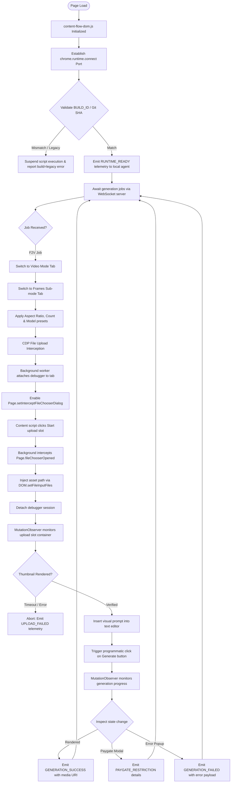

# Google Flow - BOSMAX Extension Flowchart

This flowchart visualizes the extension automation engine lifecycle, from boot verification to final generation feedback.

```mermaid
graph TD
    Boot([Page Load]) --> InitCS[content-flow-dom.js Initialized]
    InitCS --> Handshake[Establish chrome.runtime.connect Port]
    
    Handshake --> BuildVerify{Validate BUILD_ID / Git SHA}
    BuildVerify -- Mismatch / Legacy --> ErrorStale[Suspend script execution & report build=legacy error]
    BuildVerify -- Match --> TelemetryReady[Emit RUNTIME_READY telemetry to local agent]
    
    TelemetryReady --> JobListener[Await generation jobs via WebSocket server]
    JobListener --> JobRecv{Job Received?}
    
    JobRecv -- F2V Job --> ModeStep[Switch to Video Mode Tab]
    ModeStep --> SubModeStep[Switch to Frames Sub-mode Tab]
    
    SubModeStep --> ConfigSettings[Apply Aspect Ratio, Count & Model presets]
    
    ConfigSettings --> CDPUpload[CDP File Upload Interception]
    CDPUpload --> BgAttach[Background worker attaches debugger to tab]
    BgAttach --> InterceptOn[Enable Page.setInterceptFileChooserDialog]
    InterceptOn --> DomClick[Content script clicks Start upload slot]
    DomClick --> ChoiceEvent[Background intercepts Page.fileChooserOpened]
    ChoiceEvent --> InjectFile[Inject asset path via DOM.setFileInputFiles]
    InjectFile --> BgDetach[Detach debugger session]
    
    BgDetach --> ThumbObserver[MutationObserver monitors upload slot container]
    ThumbObserver --> ThumbnailVerify{Thumbnail Rendered?}
    ThumbnailVerify -- Timeout / Error --> AbortJob[Abort: Emit UPLOAD_FAILED telemetry]
    ThumbnailVerify -- Verified --> PromptStep[Insert visual prompt into text editor]
    
    PromptStep --> SubmitGen[Trigger programmatic click on Generate button]
    SubmitGen --> ProgressObserver[MutationObserver monitors generation progress]
    
    ProgressObserver --> GenState{Inspect state change}
    GenState -- Rendered --> ReportSuccess[Emit GENERATION_SUCCESS with media URI]
    GenState -- Paygate Modal --> ReportPaygate[Emit PAYGATE_RESTRICTION details]
    GenState -- Error Popup --> ReportError[Emit GENERATION_FAILED with error payload]
    
    ReportSuccess & ReportPaygate & ReportError --> JobListener
```
